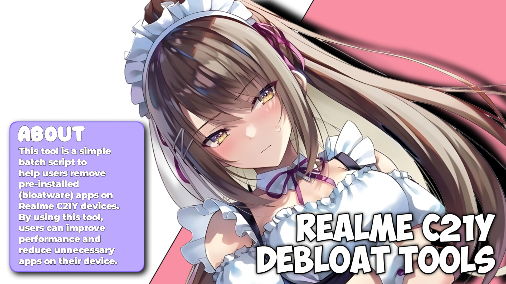

# [English](README.md) | [Bahasa Indonesia](README-ID.md)

# Realme C21Y Debloat Tools
Alat ini adalah skrip batch sederhana untuk membantu pengguna menghapus aplikasi bawaan (bloatware) pada perangkat Realme C21Y. Dengan menggunakan alat ini, pengguna dapat meningkatkan performa dan mengurangi aplikasi yang tidak diperlukan pada perangkat mereka.

## Syarat Penggunaan
- Pastikan kalian sudah menginstall unisoc usb driver (untuk Realme C21Y)
- Pastikan kalian sudah menginstall minimal adb fastboot atau platform tools
- Pastikan sudah disable driver vertification untuk windows 8+

## Instruksi Pemakaian
[English](Instruction.md) | [Bahasa Indonesia](Instruction-ID.md)

## Fitur
- Menghapus aplikasi bawaan yang tidak diinginkan
- Skrip mudah digunakan, cukup jalankan file batch

## Cara Penggunaan
1. Hubungkan perangkat Realme C21Y ke komputer menggunakan kabel USB.
2. Aktifkan mode USB Debugging di perangkat Anda.
3. Jalankan file `Realme-C21Y-Debloat-Tools.bat` dengan klik dua kali atau melalui terminal.
4. Ikuti instruksi yang muncul di layar.

## Lisensi
Proyek ini dirilis di bawah lisensi MIT.

## Kontributor
- KeishaXD
